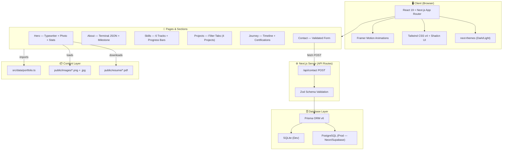
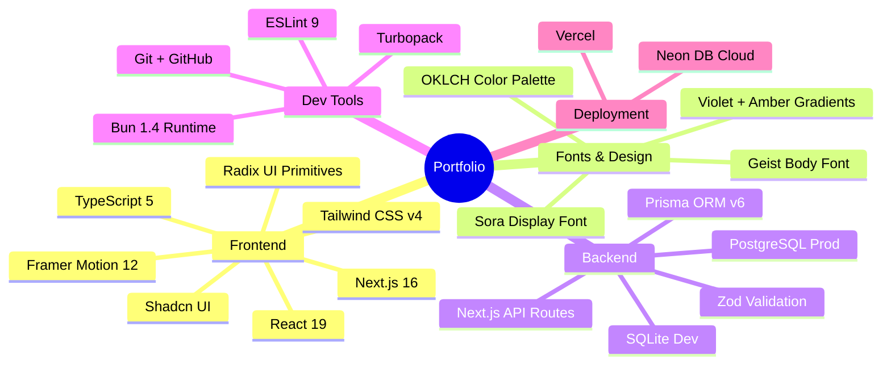
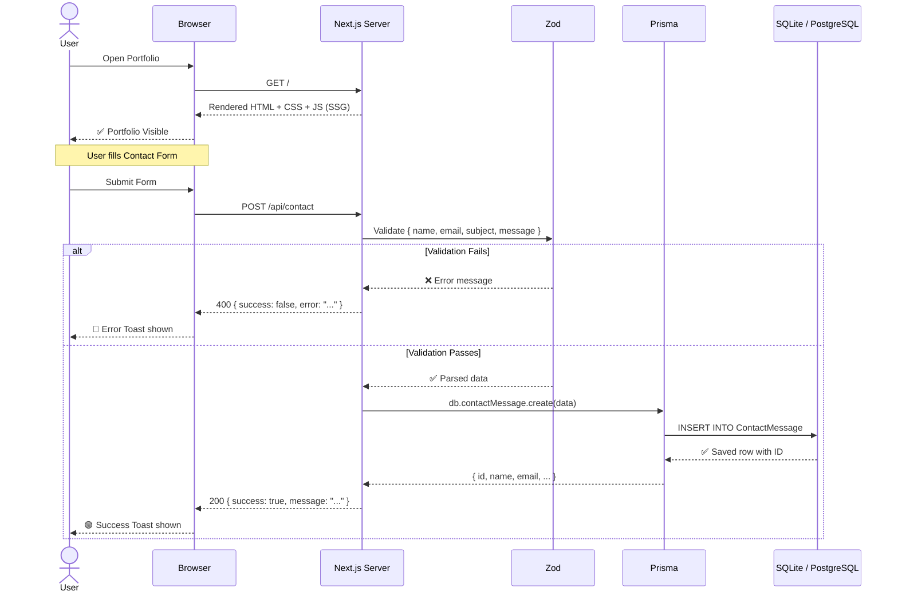
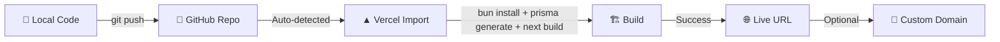
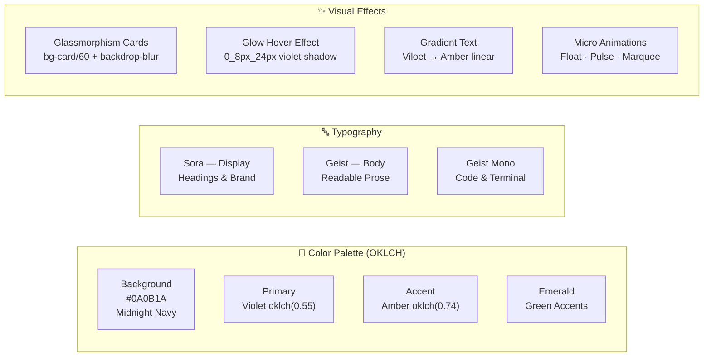

<div align="center">

```
██╗  ██╗ █████╗ ██████╗ ███████╗██╗  ██╗    ████████╗██████╗ ██╗██████╗ ██╗  ██╗ █████╗ ████████╗██╗
██║  ██║██╔══██╗██╔══██╗██╔════╝██║  ██║    ╚══██╔══╝██╔══██╗██║██╔══██╗██║  ██║██╔══██╗╚══██╔══╝██║
███████║███████║██████╔╝███████╗███████║       ██║   ██████╔╝██║██████╔╝███████║███████║   ██║   ██║
██╔══██║██╔══██║██╔══██╗╚════██║██╔══██║       ██║   ██╔══██╗██║██╔═══╝ ██╔══██║██╔══██║   ██║   ██║
██║  ██║██║  ██║██║  ██║███████║██║  ██║       ██║   ██║  ██║██║██║     ██║  ██║██║  ██║   ██║   ██║
╚═╝  ╚═╝╚═╝  ╚═╝╚═╝  ╚═╝╚══════╝╚═╝  ╚═╝       ╚═╝   ╚═╝  ╚═╝╚═╝╚═╝     ╚═╝  ╚═╝╚═╝  ╚═╝   ╚═╝   ╚═╝
```

# 🌐 Harsh Tripathi — Portfolio

### *Full-Stack Developer · Data Analyst · SEO Specialist*

<br/>

[](https://nextjs.org/)
[](https://www.typescriptlang.org/)
[](https://tailwindcss.com/)
[](https://prisma.io/)
[](https://framer.com/motion/)
[](https://bun.sh/)

<br/>

[](https://harsh-tripathi.vercel.app)
[](https://github.com/harshtriphati6390/Harsh_Tripathi_Portfolio)
[](https://www.linkedin.com/in/harsh-tripathi-2ab741330)

<br/>

> *"I build across the whole stack — from React frontends and Node.js APIs to Power BI dashboards and search-ready websites."*

</div>

---

## 📸 Preview

<div align="center">

| 🌙 Dark Mode | ☀️ Light Mode |
|:---:|:---:|
| Hero · Midnight Violet | Same design, light canvas |

</div>

---

## 🗂️ Table of Contents

- [✨ Features](#-features)
- [🏗️ Architecture](#️-architecture)
- [📁 File Structure](#-file-structure)
- [🛠️ Tech Stack](#️-tech-stack)
- [📊 Skill Coverage](#-skill-coverage)
- [🔄 Data Flow Diagram](#-data-flow-diagram)
- [🚀 Getting Started](#-getting-started)
- [🌐 Deployment](#-deployment)
- [🔧 Configuration](#-configuration)
- [📬 API Reference](#-api-reference)
- [👤 Author](#-author)

---

## ✨ Features

```
╔══════════════════════════════════════════════════════════════════╗
║  🌙 Dark / Light Theme     Persistent across sessions (localStorage)   ║
║  ⌨️  Typewriter Effect      Cycles: Developer → Analyst → SEO          ║
║  🖼️  Real Photo + Badges   Hero card with floating tech badges          ║
║  📊 Skill Progress Bars   Animated bars across 6 technology tracks      ║
║  🗂️  Project Filter Tabs   Framer Motion layout animations              ║
║  📬 Contact Form → API    Validated → Prisma → SQLite / PostgreSQL     ║
║  📄 Resume Download       One-click PDF from hero section               ║
║  📱 Fully Responsive      Mobile-first, works on all screen sizes       ║
║  🔍 SEO Optimised         Metadata, OG tags, structured semantic HTML   ║
║  🎨 OKLCH Palette         Violet + Amber on Midnight Navy               ║
╚══════════════════════════════════════════════════════════════════╝
```

---

## 🏗️ Architecture



---

## 📁 File Structure

```
harsh-portfolio/
│
├── 📄 README.md                    # You are here!
├── 📄 package.json                 # Scripts & dependencies
├── 📄 next.config.ts               # Next.js + Turbopack config
├── 📄 tailwind.config.ts           # Tailwind design tokens
├── 📄 tsconfig.json                # TypeScript config
├── 📄 prisma/
│   └── 📄 schema.prisma            # Database schema (ContactMessage)
│
├── 📁 public/
│   ├── 📁 images/
│   │   ├── 🖼️  harsh-photo.jpg     # Real profile photo (hero card)
│   │   ├── 🖼️  project-taskflow.png
│   │   ├── 🖼️  project-heartiq.png
│   │   ├── 🖼️  project-bankwise.png
│   │   └── 🖼️  project-seo.png
│   └── 📁 resume/
│       └── 📄 Harsh_Tripathi_Resume.pdf
│
├── 📁 db/
│   └── 🗄️  custom.db               # SQLite database (dev only)
│
└── 📁 src/
    ├── 📁 app/
    │   ├── 📄 layout.tsx            # Root layout + SEO metadata + fonts
    │   ├── 📄 page.tsx              # Main portfolio page (assembles sections)
    │   ├── 📄 globals.css           # OKLCH design tokens + animations
    │   └── 📁 api/
    │       └── 📁 contact/
    │           └── 📄 route.ts      # POST /api/contact → Zod → Prisma
    │
    ├── 📁 components/
    │   ├── 📄 theme-provider.tsx    # next-themes wrapper
    │   ├── 📁 portfolio/            # All portfolio section components
    │   │   ├── 🎯 navbar.tsx        # Scroll-spy nav + theme toggle
    │   │   ├── 🎯 hero.tsx          # Typewriter + photo + stats + ticker
    │   │   ├── 🎯 about.tsx         # Terminal card + milestone + 3 cards
    │   │   ├── 🎯 skills.tsx        # 6 skill tracks + animated progress
    │   │   ├── 🎯 projects.tsx      # Filter tabs + project cards
    │   │   ├── 🎯 journey.tsx       # Timeline + certs + education
    │   │   ├── 🎯 contact.tsx       # Form + contact info + socials
    │   │   ├── 🎯 footer.tsx        # Footer with nav links + social
    │   │   ├── 🎯 section-heading.tsx
    │   │   └── 🎯 theme-toggle.tsx  # Sun/Moon toggle button
    │   └── 📁 ui/                   # Shadcn/ui component library (40+ comps)
    │       ├── button.tsx
    │       ├── input.tsx
    │       ├── toast.tsx
    │       └── ... (40+ components)
    │
    ├── 📁 data/
    │   └── 📄 portfolio.ts          # ⭐ Single source of truth for all content
    │
    ├── 📁 hooks/
    │   ├── 📄 use-toast.ts
    │   └── 📄 use-mobile.ts
    │
    └── 📁 lib/
        ├── 📄 db.ts                 # Prisma client singleton
        └── 📄 utils.ts              # cn() helper
```

---

## 🛠️ Tech Stack



---

## 📊 Skill Coverage

> All skill levels from `src/data/portfolio.ts`

```
Frontend Development
  HTML5 & CSS3          ████████████████████████░░  92%
  Bootstrap & Responsive ███████████████████████░░░  90%
  JavaScript (ES6+)     ██████████████████████░░░░  88%
  React.js              █████████████████████░░░░░  82%

Backend & APIs
  REST API Design       ██████████████████████░░░░  88%
  Node.js & Express     █████████████████████░░░░░  85%
  FastAPI (Python)      ████████████████████░░░░░░  80%
  JWT Authentication    ████████████████████░░░░░░  80%

Databases
  MySQL / SQL Server    █████████████████████░░░░░  85%
  MongoDB               ████████████████████░░░░░░  78%
  SQL Queries & Joins   ██████████████████████░░░░  88%

Data Analytics
  Power BI Dashboards   ██████████████████████░░░░  88%
  DAX Measures          █████████████████████░░░░░  84%
  EDA & Visualization   █████████████████████░░░░░  85%
  Excel Advanced        ████████████████████░░░░░░  80%

SEO & Marketing
  Technical SEO Audits  ██████████████████████░░░░  88%
  Google Search Console ████████████████████░░░░░░  82%
  Keyword Research      ████████████████████░░░░░░  80%
  Content Strategy      ███████████████████░░░░░░░  76%

Tools & Workflow
  Git & GitHub          ██████████████████████░░░░  88%
  VS Code & DevTools    ████████████████████████░░  92%
  Postman / API Testing ████████████████████░░░░░░  80%
```

---

## 🔄 Data Flow Diagram



---

## 🚀 Getting Started

### Prerequisites

```bash
# Required
Node.js 18+  (or Bun 1.4)
Git

# Recommended
Bun (faster installs & runs)
```

### Installation

```bash
# 1. Clone the repository
git clone https://github.com/harshtriphati6390/Harsh_Tripathi_Portfolio.git
cd Harsh_Tripathi_Portfolio

# 2. Install dependencies (with Bun)
bun install

# or with npm
npm install
```

### Setup Database

```bash
# 3. Configure environment
cp .env.example .env

# .env file content:
# DATABASE_URL="file:../db/custom.db"

# 4. Push schema to SQLite
bun run db:push

# 5. Generate Prisma client
bun run db:generate
```

### Run Dev Server

```bash
# 6. Start development server
bun run dev
```

🎉 Open **[http://localhost:3000](http://localhost:3000)** — Portfolio is live!

---

## 🌐 Deployment

### Deploy to Vercel (Recommended)



#### Step-by-step:

| Step | Action |
|------|--------|
| 1️⃣ | Push code to GitHub (already done!) |
| 2️⃣ | Go to [vercel.com](https://vercel.com) → **New Project** |
| 3️⃣ | Import `Harsh_Tripathi_Portfolio` repository |
| 4️⃣ | Add env variable: `DATABASE_URL` = your DB URL |
| 5️⃣ | Click **Deploy** ✅ |

> **For production contact form persistence**, use a cloud DB:
> - [Neon.tech](https://neon.tech) — Free PostgreSQL
> - [Supabase](https://supabase.com) — Free PostgreSQL

### Switch to PostgreSQL

```prisma
// prisma/schema.prisma
datasource db {
  provider = "postgresql"  // ← change from "sqlite"
  url      = env("DATABASE_URL")
}
```

---

## 🔧 Configuration

### Customize Content

All content lives in **one file** — [`src/data/portfolio.ts`](./src/data/portfolio.ts):

```typescript
export const profile = {
  name: "Harsh Tripathi",
  roles: ["Full-Stack Developer", "Data Analyst", "SEO Specialist"],
  email: "k.tripathiharsh2005@gmail.com",
  github: "https://github.com/harshtriphati6390",
  linkedin: "https://www.linkedin.com/in/harsh-tripathi-2ab741330",
  // ... edit anything here!
};
```

### Available Scripts

| Command | Description |
|---------|-------------|
| `bun run dev` | Start dev server on port 3000 |
| `bun run build` | Production build |
| `bun run start` | Start production server |
| `bun run lint` | Run ESLint |
| `bun run db:push` | Push schema to DB |
| `bun run db:generate` | Generate Prisma Client |
| `bun run db:migrate` | Run DB migrations |

---

## 📬 API Reference

### `POST /api/contact`

Save a contact form message to the database.

**Request Body:**
```json
{
  "name": "Jane Doe",
  "email": "jane@example.com",
  "subject": "Job Opportunity",
  "message": "Hi Harsh, I'd love to connect..."
}
```

**Success Response `200`:**
```json
{
  "success": true,
  "id": "cmufmpq080000uq4ofj2mjykl",
  "message": "Message received! Harsh will get back to you soon."
}
```

**Error Response `400`:**
```json
{
  "success": false,
  "error": "Please enter a valid email address"
}
```

**Validation Rules:**

| Field | Min | Max | Rule |
|-------|-----|-----|------|
| `name` | 2 chars | 100 chars | Required |
| `email` | — | — | Valid email format |
| `subject` | 2 chars | 150 chars | Required |
| `message` | 10 chars | 2000 chars | Required |

---

## 📈 Project Highlights

```
┌─────────────────────────────────────────────────────────────────────┐
│                        PROJECT SHOWCASE                              │
├───────────────┬──────────────────────────┬───────────────────────────┤
│  TaskFlow     │  Node.js + Express       │  Full-Stack Task Manager  │
│               │  React + Bootstrap       │  JWT Auth + MySQL         │
├───────────────┼──────────────────────────┼───────────────────────────┤
│  HeartIQ      │  FastAPI + Python        │  Heart Disease Prediction │
│               │  MongoDB + JavaScript    │  ML model + REST API      │
├───────────────┼──────────────────────────┼───────────────────────────┤
│  BankWise     │  Power BI + DAX          │  Loan Risk Dashboard      │
│               │  SQL Server              │  KPI metrics + Visuals    │
├───────────────┼──────────────────────────┼───────────────────────────┤
│  SEO Campaign │  Google Search Console   │  Technical SEO for        │
│               │  GA4 + SEMrush           │  personal websites        │
└───────────────┴──────────────────────────┴───────────────────────────┘
```

---

## 🎨 Design System



---

## 📦 Dependencies Overview

```
Production (82 packages)              Dev (9 packages)
├── next ^16.1.3                      ├── typescript ^5
├── react ^19.0.0                     ├── tailwindcss ^4
├── framer-motion ^12.23.2            ├── @tailwindcss/postcss ^4
├── @prisma/client ^6.19.2           ├── eslint ^9
├── next-themes ^0.4.6               ├── eslint-config-next ^16
├── zod ^4.0.2                        ├── @types/react ^19
├── lucide-react ^0.525.0            ├── @types/react-dom ^19
├── @tanstack/react-query ^5.82.0   └── tw-animate-css ^1.3.5
├── shadcn/ui (40+ components)
└── ... (many more)
```

---

## 🤝 Contributing

Contributions are welcome! If you find a bug or have a suggestion:

1. Fork the repo
2. Create a feature branch: `git checkout -b feature/amazing-feature`
3. Commit your changes: `git commit -m 'feat: add amazing feature'`
4. Push: `git push origin feature/amazing-feature`
5. Open a Pull Request

---

## 📄 License

This project is open source and available under the [MIT License](LICENSE).

---

<div align="center">

## 👤 Author

```
╔══════════════════════════════════════════════════════╗
║                                                      ║
║            ✦  HARSH TRIPATHI  ✦                     ║
║                                                      ║
║   B.Tech CSE Graduate · Class of 2026               ║
║   NITRA Technical Campus, Ghaziabad                 ║
║   Noida, Uttar Pradesh, India                       ║
║                                                      ║
║   Full-Stack Developer · Data Analyst               ║
║   SEO Specialist · Software Developer               ║
║                                                      ║
╚══════════════════════════════════════════════════════╝
```

[](mailto:k.tripathiharsh2005@gmail.com)
[](https://www.linkedin.com/in/harsh-tripathi-2ab741330)
[](https://github.com/harshtriphati6390)
[](tel:+916390503738)

<br/>

---

```
 ___  ___  ________  ________  _______   ________     ________  ___    ___ 
|\  \|\  \|\   __  \|\   __  \|\  ___ \ |\   __  \   |\   __  \|\  \  /  /|
\ \  \\\  \ \  \|\  \ \  \|\  \ \   __/|\ \  \|\  \  \ \  \|\ /\ \  \/  / /
 \ \   __  \ \   __  \ \   _  _\ \  \_|/_\ \   ____\  \ \   __  \ \    / / 
  \ \  \ \  \ \  \ \  \ \  \\  \\ \  \_|\ \ \  \___|   \ \  \|\  /\/  /  /  
   \ \__\ \__\ \__\ \__\ \__\\ _\\ \_______\ \__\        \ \_______/\__/ /  
    \|__|\|__|\|__|\|__|\|__|\|__|\|_______|\|__|         \|_______\|__|/   

        Made with ❤️  by  HARSH TRIPATHI  |  © 2026  |  All Rights Reserved
```

*⭐ If you liked this portfolio, please give it a star on GitHub!*

</div>
